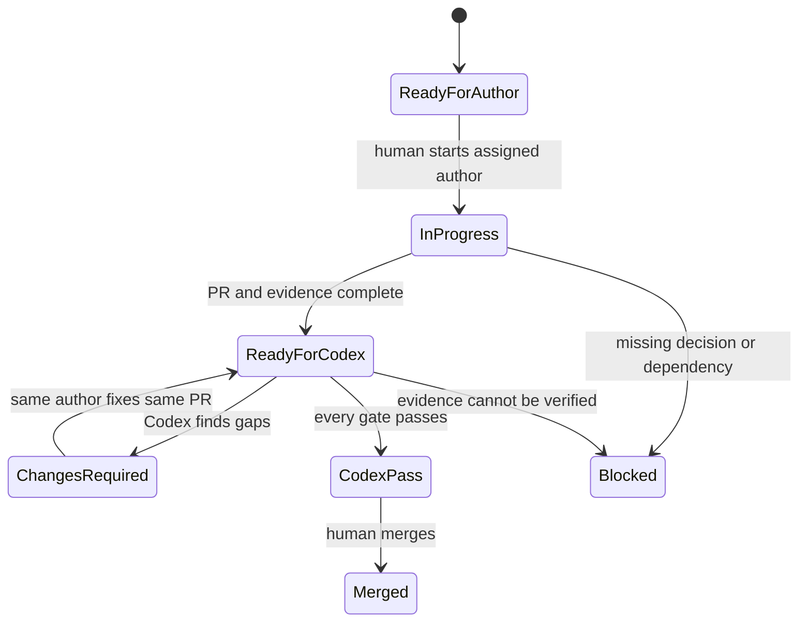

# 9Router / Gemini → Codex Semi-Manual Delivery Workflow

## Decision

The tools do not share chat history and do not automatically wake one another. They coordinate through one GitHub repository, one root `AGENTS.md`, one prepared Work Item, one feature branch and one Pull Request. The human explicitly starts implementation, starts Codex review and performs the merge; CI and versioned evidence carry the handoff.

## Responsibility map

| Artifact/action | Claude | Codex planner | 9Router worker | Gemini | Codex reviewer | Human |
|---|---:|---:|---:|---:|---:|---:|
| Propose business/solution updates | Owner | Validate and version | No | No | Verify source | Approve decisions |
| Prepare executable Work Item | No | Owner | No | No | No | Resolve blockers |
| Choose implementation author | No | Recommend | No | No | Challenge if unsafe | Confirm/start |
| Implement production code | No | No | Low-risk only | Primary owner | No | No |
| Add and run tests | No | Define evidence | Owner for assigned scope | Owner | Verify independently | Observe |
| Open/update Pull Request | No | Planning commit only | Owner when assigned | Owner when assigned | Read/comment | Observe |
| Approve implementation | No | No | No self-approval | No self-approval | Recommend | Final owner |
| Merge to `main` | No | No | No | No | No | Owner |

## State flow

## One-time local setup

| Workspace | Branch parked after setup | Purpose |
|---|---|---|
| `C:\Users\gumac\AI\shipde-platform` | `main` | Integration baseline; never direct implementation |
| `C:\Users\gumac\AI\shipde-dsh` | `agent/dsh` | 9Router/DSH low-risk author |
| `C:\Users\gumac\AI\shipde-gemini` | `agent/gemini` | Gemini primary author |
| `C:\Users\gumac\AI\shipde-codex` | `agent/codex-review` | Codex planning and independent review |

Each application opens only its own workspace. Complete and verify this layout with `WINDOWS-SETUP-RUNBOOK.md` and the safe commands under `scripts/ai/`. Before a new Work Item, fetch `origin`, create the prepared feature branch from current `origin/main`, and confirm `git status` is clean. Do not reuse an unmerged branch for another item.

Configure DSH and 9Router exactly as recorded in `AI-TOOLCHAIN-DECISIONS.md`: local endpoint only, Ponytail/Caveman/Headroom/request logging OFF and no committed credential. Protect `main`: disallow direct pushes and force pushes, require Pull Requests, require the always-present `contract` and `application-gate` checks, and require resolved review conversations.

## Per-Work-Item procedure

### 1. Codex prepares the next item

Use `FEATURE-DELIVERY-REGISTER.csv` in ascending `delivery_order`. Dependencies must be `MERGED`. In a planning-only task, Codex creates the feature branch from latest `main`, creates/fills the Work Item, chooses `GEMINI` or `9ROUTER`, records risk and allowed paths, and changes only that row to `READY_FOR_AUTHOR`. It changes no production code.

Foundation items run before product features. Use `CODEX-PLANNING-PROMPT.md`.

### 2. Human starts the assigned author

- If assigned `GEMINI`, open `shipde-gemini`, fetch the prepared branch and use `GEMINI-START-PROMPT.md`.
- If assigned `9ROUTER`, open `shipde-dsh`, fetch the prepared branch and use `NINEROUTER-START-PROMPT.md`.

The author verifies branch, Work Item, allowed scope and readiness before editing. It implements one Work Item, runs the required checks, updates evidence, opens one Pull Request, marks `READY_FOR_CODEX` and stops.

### 3. CI verifies the handoff

The `contract` check runs for every Pull Request and validates the product specification, PR contract and PowerShell control-script syntax. The `application-gate` check also always reports: it runs clean install, lint, build and current E2E only when application-affecting paths changed, otherwise records that those checks are not applicable. A failed required check is returned to the same author with its exact log. The author must not claim readiness while CI is red.

### 4. Human starts independent Codex review

Open a fresh Codex review task in `shipde-codex` with the PR URL and `CODEX-REVIEW-PROMPT.md`. The reviewer reads the repository evidence rather than relying on the planning or author conversation. It returns exactly `PASS`, `CHANGES_REQUIRED` or `BLOCKED` and posts actionable findings.

### 5. Correction loop

`CHANGES_REQUIRED` returns to the same implementation author and same branch. The author fixes findings, reruns the complete validation set and updates the PR evidence. Two failed 9Router correction rounds escalate the item to Gemini; record the author change in the Work Item. Every updated commit requires a fresh Codex verdict.

### 6. Human merge and workspace sync

The human merges only when CI is green, every acceptance row has evidence, Codex returns `PASS`, review conversations are resolved and residual limitations are explicitly accepted. After merge, reconcile the register to `MERGED`, record PR/merge commit, then fast-forward each parked agent branch from `origin/main` before preparing another item.

## Routing rules

### Assign 9Router only for bounded low-risk work

- deterministic fixtures, carrier mocks and seed data;
- focused unit tests for already specified behavior;
- types, schemas or generated/mechanical updates with an existing contract;
- small CRUD or lint fixes with no ownership, authorization or money decision;
- documentation or evidence updates that do not change product meaning.

### Assign Gemini for primary implementation

- foundation migration and repository architecture;
- complete frontend/backend/persistence features;
- authentication, authorization and tenant isolation;
- carrier commands, retries, reconciliation and external effects;
- COD, wallet, billing and any money behavior;
- user-facing flows, design-system composition and accessibility;
- database migrations or cross-module changes.

## Manual control points

The human must explicitly approve or start:

1. material business/solution decisions;
2. the selected Work Item and implementation author;
3. important UI outcomes;
4. changes involving money, permissions, secrets, destructive migrations or production integrations;
5. Codex review and final merge/release.

## Failure handling

| Situation | Required action |
|---|---|
| Business rule missing or contradictory | Mark `BLOCKED`; no agent may invent it |
| Carrier capability unverified | Use explicit unverified/unsupported state and deterministic mock/manual fallback |
| 9Router reaches a prohibited domain or fails twice | Stop and escalate same Work Item to Gemini |
| 9Router injects Ponytail/Caveman or changes evidence through compression | Stop, disable the feature and repeat verification from uncompressed evidence |
| DSH/9Router version or model catalog changes mid-item | Pin the working version/model or mark `BLOCKED`; never silently substitute |
| Author cannot open a PR | Push branch and provide commit; human opens PR with the template |
| CI fails | Same author fixes the exact failure before review |
| Codex cannot verify evidence | Return `BLOCKED`, never a conditional pass |
| PR contains more than one Work Item | Split before review |
| Existing prototype appears complete | Reassess against the full Definition of Done; demo UI is insufficient |
