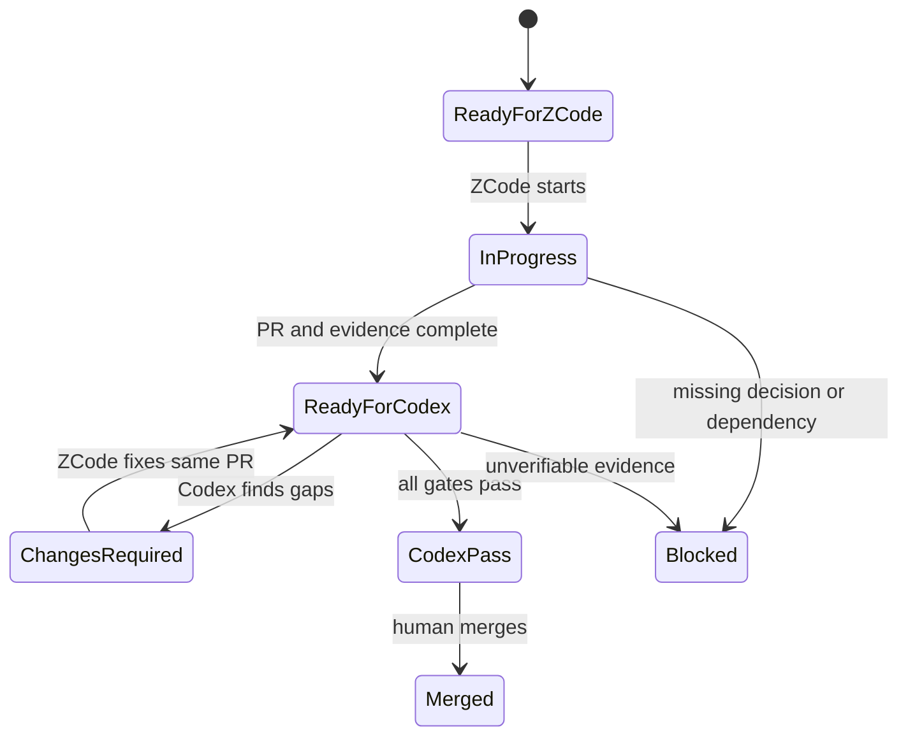

# ZCode → Codex Delivery Workflow

## Decision

ZCode and Codex do not need shared chat history. They share one GitHub repository, one root `AGENTS.md`, one Codex-prepared Work Item, one feature branch and one Pull Request. GitHub is the durable handoff channel.

ZCode officially reads the workspace-root `AGENTS.md`. Codex also reads repository `AGENTS.md` instructions during GitHub review. Therefore the root file contains all non-negotiable rules; nested documents provide detail.

## Responsibility map

| Artifact/action | ZCode | Codex | Human |
|---|---:|---:|---:|
| Read product specification | Required | Required | As needed |
| Prepare business-ready Work Item | No | Owner in planning task | Resolve business conflict |
| Prepare technical implementation plan | Owner | Challenge in review | Observe |
| Change production code | Owner | No during independent review | Optional later |
| Add and run tests | Owner | Verify/run independently | Observe |
| Open/update Pull Request | Owner | Read | Observe |
| Review every feature | No self-approval | Owner | Final oversight |
| Approve residual risk | No | Recommend only | Owner |
| Merge to `main` | No | No | Owner |

## State flow

## One-time setup

1. Clone `vinh05092001/shipde-platform` in ZCode and open the repository root as the workspace.
2. Connect the same repository to Codex Cloud and enable Code review in Codex settings.
3. Prefer automatic Codex reviews for new Pull Requests. If unavailable, add the exact GitHub comment `@codex review` to every PR.
4. Protect `main`: disallow direct pushes, require Pull Request, require CI checks and prevent merging unresolved review conversations.
5. Keep one active implementation PR until the workflow is proven; increase concurrency only when modules do not overlap.

Official setup references:

- ZCode project instructions: <https://zcode.z.ai/en/docs/agents>
- Codex GitHub review: <https://learn.chatgpt.com/docs/third-party/github>

## Per-feature operating procedure

### 1. Codex prepares the next item

In a planning-only Codex task, use `FEATURE-DELIVERY-REGISTER.csv` in ascending `delivery_order`. All dependencies must be `MERGED`. Codex creates `feat/<work-item-id>-<slug>` from the latest `main`, copies `WORK-ITEM-TEMPLATE.md` to `docs/product-spec/work-items/<FEAT-ID>.md`, fills every business and acceptance section, resolves specification gaps with the user when material, and changes only that row to `READY_FOR_ZCODE` on the new branch. Foundation items in `FOUNDATION-WORK-ITEMS.md` run before product features.

Use `CODEX-PLANNING-PROMPT.md`. ZCode must never receive an unprepared feature row and must not invent the missing Work Item itself.

### 2. Give the prepared item to ZCode

Start a new ZCode task inside the repository workspace. Checkout the branch prepared by Codex, then paste the prompt from `ZCODE-START-PROMPT.md` with the Work Item and branch already filled. Do not attach the entire documentation archive; the files are already in the repository and remain versioned.

ZCode must stop after opening the Pull Request. It must not begin the next feature while review is pending.

### 3. Trigger Codex

Automatic mode: Codex reviews when the PR opens. Manual mode: comment `@codex review`, then run the deeper review prompt from `CODEX-REVIEW-PROMPT.md` in the Codex app with the PR URL.

The GitHub quick review is a high-severity safety net. The deeper feature review is the acceptance gate and must produce a requirement-by-requirement verdict.

### 4. Correction loop

When Codex returns `CHANGES_REQUIRED`, ZCode reads the review comments, fixes only the same Work Item on the same branch, reruns the full verification set and updates the PR evidence. Trigger Codex again. Do not close findings merely by explaining them; either change the implementation or record a human-approved decision.

### 5. Merge and advance

A human merges only when:

- CI is green from a clean checkout;
- every acceptance row has evidence;
- Codex verdict is `PASS`;
- no unresolved conversation remains;
- residual limitations are `None` or explicitly accepted by the human merge owner.

After merge, the next Codex planning operation first reconciles the completed row to `MERGED`, records PR and merge commit, then prepares only the next dependency-ready item. If no next item is being prepared, use a small status-only documentation PR.

## Why one PR per function

One feature ID per PR gives Codex a bounded review target, prevents partial completion from hiding inside a large change, and provides a durable audit trail from requirement to implementation. Foundation work uses `TASK-FOUND-*` IDs under the same rule.

## Failure handling

| Situation | Required action |
|---|---|
| Business rule missing or contradictory | Mark `BLOCKED`; Codex/ZCode must not invent it |
| Carrier API not verified | Implement adapter contract plus explicit mock/manual fallback; do not claim live support |
| ZCode cannot open a PR | Push the branch and provide branch/commit; human opens PR using the template |
| Codex review does not start | Verify repository connection and use exact `@codex review` comment |
| CI cannot run external sandbox | Run deterministic mock tests and mark live contract test `BLOCKED_EXTERNAL` |
| PR contains multiple features | Split it before review |
| Existing prototype appears to implement feature | Reassess against full DoD; demo UI alone remains incomplete |
